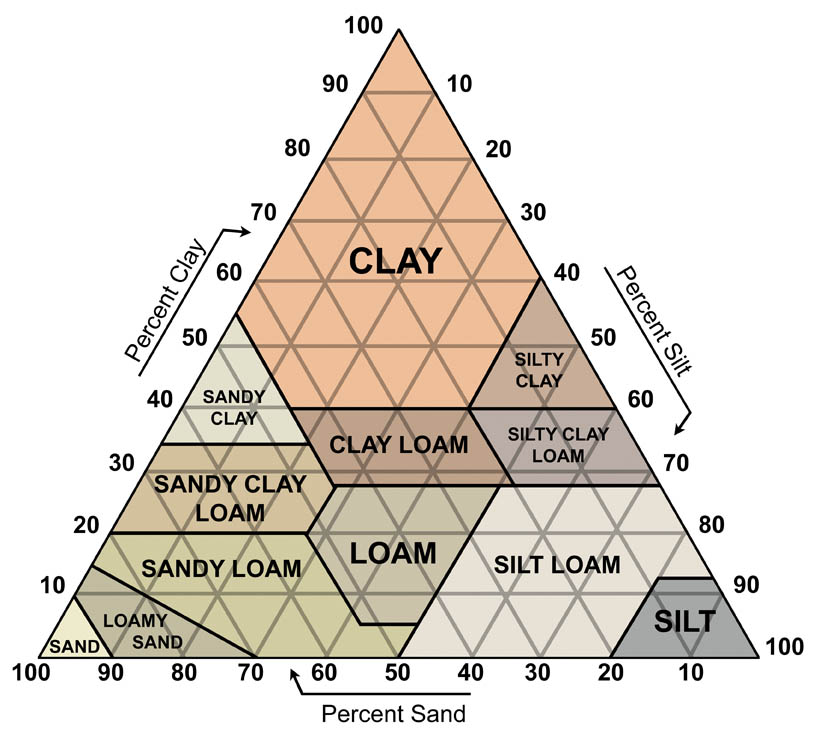

```{r setup, include=FALSE}
knitr::opts_chunk$set(echo = FALSE, message=FALSE, warning=FALSE)
```

# Introduction

Maize, also known as corn in North America, is one of the most commonly consumed crops in the world. It is used to make many different products including animal feed, cornstarch, and corn syrup.
In this paper, we are interested in factors that influence its yield. There will be significant implications for food availability, and business profitability.

# Data

The data were downloaded from Data Mendeley at https://data.mendeley.com/datasets/7m3pjrz52x . 
It is a collection of data from many different studies on maize yield, and was originally featured in a paper by Li et al (2019). In this project, I focus on maize yield data from China, in order to control for correlation due to country’s agriculture laws & policies, farming techniques, and technology. Since China is a large country spanning many different types of geographic regions with different climates and soil types, there was more data available for comparing different soil types. China is one of the biggest producers of maize, so the findings will be relevant for global food production.

The data contained measurements of maize yield (tonnes/hectare), water level from both irrigation and rainfall (mm), soil texture, mean annual temperature (degrees Celcius), nitrogen level (kg/hectare), density (plants per hectare), and soil organic content .

There are different types of soil made of varying percentages of sand, silt, and clay. Sand has the largest particle size, followed by silt, and then clay. Sand is the worst at retaining water, followed by silt, then clay. Maize has shallow roots so it is unable to dig deep into the ground to absorb nutrients. Thus the soil's ability to hold onto water is important for maize growth.



## Missing Data

There were 80 observations missing Soil Texture type. I intend to build a Bayesian hierarchical model with soil being a level in the hierarchy. Thus I removed these rows from the dataset.

• Some soil types missing lots of data on Plants Per Hectare 
(PPH), don’t have a lot of observations to begin with
• PPH seems to have been kept constant in other soil groups.
• May not be able to use it in model
• SOC missing 168 observations, wasn’t significant anyway

```{r}
library(tidyverse)
library(readxl)
datamaize <- read_csv("Book2.csv")
datamaize_readme <- read_xlsx("Dataset instrumetn.xlsx")

datamaizechina <- datamaize %>% filter(Region == "China") %>%
  dplyr::select(Yield, MAP, MAT, Texture, PPH, SOC, Water, Nitrogen)

datamaizechina %>% filter(!is.na(Yield)) -> datamaizechina

datamaizechina["Texture"][datamaizechina["Texture"] == "silty loam"] <- "silt loam"
datamaizechina["Texture"][datamaizechina["Texture"] == "loamy clay"] <- "clay loam"
datamaizechina["Texture"][datamaizechina["Texture"] == "slity clay"] <- "clay silt"
datamaizechina["Texture"][datamaizechina["Texture"] == "heavy loam"] <- "loam"
```

```{r}
datamaizechina %>% filter(!is.na(Texture)) -> datamaizechina
```

## Summary Statistics

```{r}
library(knitr)
datamaizechina %>% dplyr::select(-MAP, -Texture) %>% summary() %>% kable()
```

We see that there is less data available for the clay and sandy soil texture types. This is to be expected since clay soil represents the finest possible soil and sandy soil is the coarsest possible soil. It is rare to observe such extreme soil types in nature that are suitable for agriculture.

```{r}
library(ggrepel)
datamaizechina %>% group_by(Texture) %>%
  summarize(prop = n()/nrow(datamaizechina)) -> dfpie
dfpie %>%  ggplot(aes(x="", y= prop, fill = Texture)) +
  geom_col() + 
  coord_polar(theta = "y") + theme_bw() +
  scale_fill_brewer(palette = "Pastel1") +
  geom_label_repel(data = dfpie,
                   aes(y = prop, label = paste0(round(prop*100, digits = 2), "%")),
                   size = 4.5, position = position_stack(vjust=0.5), show.legend = FALSE) +
  guides(fill = guide_legend(title = "Soil Texture"))

# geom_text(aes(label = prop), position = position_stack(vjust=0.5)) +
```

## Plots of Covariates against Maize Yield

From the following boxplot, we see that clay silt soil seems to have the greatest yield. However, this finding should be taken with caution since it is only based on 8 data points. 

```{r}
datamaizechina %>% ggplot(aes(x=Texture, y=Yield)) + geom_boxplot() + theme_bw() + labs(x= "Soil Texture", y="Yield (t/ha)")
```

We see that water and soil type jointly influence maize growth. For finer soil types like clay and clay loam, increasing water seemed to either have little effect or slightly negative effect on yield. This is possibly due to finer soil types retaining too much water. For coarser soil types like sandy and sandy loam, which are worse at retaining water, increasing water seemed to increase yield. Since coarser soil types are worse at retaining water, increasing water compensates for the soil's decreased ability to retain water, and is thus beneficial for plant growth.

```{r}
datamaizechina %>% ggplot(aes(x=Water, y=Yield, col=Texture)) + geom_point() + geom_smooth(method="lm", se=FALSE) + theme_bw() + labs(x="Water from irrigation & rainfall (mm)", y="Yield (t/ha)")
```

 For most soil types, as nitrogen increases, yield either doesn’t change much, or increases slightly but plateaus after. The exception seems to be sandy soil, which is the coarsest type of soil which does not hold onto water/nutrients well.

```{r}
datamaizechina %>% ggplot(aes(x=Nitrogen, y=Yield, col=Texture)) + geom_point() + geom_smooth(method="loess", se=FALSE) + labs(x="Nitrogen (kg/ha)", y="Yield (t/ha)") + theme_bw()
```

For most soil types except silt loam, increasing plant density seemed to increase yield
Perhaps farmers already knew how dense to plant their seeds before plants start competing with each other


```{r}
datamaizechina %>% ggplot(aes(x=(PPH), y=Yield, col=Texture)) + geom_point() + geom_smooth(method="lm", se=FALSE) + labs(x="Number of Plants Per Hectare", y="Yield (t/ha)") + theme_bw()
```

Increasing temperature seemed to have a negative effect on yield. Perhaps warmer climates have longer growing 
seasons, so the soil is more depleted of nutrients during the year. Soil type and temperatures correlated due to geographic region.

```{r}
datamaizechina %>% ggplot(aes(x=MAT, y=Yield, col=Texture)) + geom_point() + geom_smooth(method="lm", se=FALSE) +labs(x="Mean annual temperature (degrees Celcius)", y="Yield (t/ha)") + theme_bw()
```

## Determining Appropriate Likelihood

Maize Yield is a continuous variable, and its histogram seems to be fairly symmetric and bell-shaped. 

```{r}
boxcoxyield <- MASS::boxcox(lm(datamaizechina$Yield ~ 1))
bestlambda <- boxcoxyield$x[which.max(boxcoxyield$y)]
```
```{r}
datamaizechina %>% ggplot(aes(x=(Yield))) + geom_histogram() + facet_wrap(Texture ~ .)
```

```{r}
box <- function(y, lambda){
  return(((y^lambda)-1)/lambda)
}
datamaizechina %>% ggplot(aes(x=(Yield))) + geom_histogram()
qqnorm((datamaizechina$Yield))
qqline((datamaizechina$Yield))
shapiro.test((datamaizechina$Yield))
```
```{r}
datamaizechina %>% ggplot(aes(x=box(Yield,bestlambda))) + geom_histogram() + labs(x="Box-Cox Transformed Maize Yield") + theme_bw()
qqnorm(box(datamaizechina$Yield, bestlambda))
qqline(box(datamaizechina$Yield, bestlambda))
shapiro.test(box(datamaizechina$Yield, bestlambda))
```


```{r}
datamaizechina %>% ggplot(aes(x=Texture, y=MAT)) + geom_boxplot()
```


```{r}
datamaizechina %>% ggplot(aes(x=SOC, y=Yield, col=Texture)) + geom_point() + labs(x="Initial Soil Organic Carbon", y="Yield (t/ha)") + geom_smooth(method="lm") + theme_bw()
```


```{r}
datamaizechina %>% ggplot(aes(x=SOC, y=Nitrogen)) + geom_point() + labs(x="Initial Soil Organic Carbon", y="Nitrogen level (kg/ha)") + geom_smooth() + theme_bw()
```

```{r}
soil_vars <- datamaizechina %>% group_by(Texture) %>% summarize(var_by_soil = var(Yield))
soil_vars
```

```{r}
cor(datamaizechina$Water, datamaizechina$Nitrogen)
plot(datamaizechina$Water, datamaizechina$PPH)
plot(datamaizechina$Nitrogen, datamaizechina$PPH)
```

Temperature and soil texture were correlated due to geographic region. For certain soil types, there was very little variance in temperature. Since I intended to stratify based on soil, I decided not to include temperature in the model. 

```{r}
datamaizechina %>% ggplot(aes(x=Texture, y=MAT)) + geom_boxplot()
```

## Methods

We fit a Bayesian hierarchical model on maize yield, with soil type being a level in the hierarchy. After stratifying by soil type, we consider the effects of water and nitrogen levels on maize yield. The model is given as follows:

$$y_{j} | \alpha_{j[i]}, \beta_{j[i]}, \gamma_{j[i]}, \sigma^2_y \sim N(\alpha_{j[i]} + \beta_{j[i]}N_i + \gamma_{j[i]}W_i , \sigma^2_y )$$
\begin{center}
$y_j$ is transformed maize yield (t/ha), $W_i$ is water (mm), $N_i$ is nitrogen (kg/ha), $j[i]$ corresponds to the soil texture for observation $i$
\end{center}
$$\sigma^2_y \sim N^+ (0,1)$$
$$\alpha_j \sim N(\mu_{\alpha}, \sigma^2_{\alpha})$$
$$\mu_{\alpha} \sim N(0,1)$$
$$\sigma^2_{\alpha} \sim N^+ (0,1)$$
$$\beta_j \sim N(\mu_{\beta}, \sigma^2_{\beta})$$
$$\mu_{\beta} \sim N(0,1)$$
$$\sigma^2_{\beta} \sim N^+ (0,1)$$
$$\gamma_j \sim N(\mu_{\gamma}, \sigma^2_{\gamma})$$
$$\mu_{\gamma} \sim N(0,1)$$
$$\sigma^2_{\gamma} \sim N^+ (0,1)$$

# Results

```{r}
library(rstan)
#maize <- box(datamaizechina$Yield,bestlambda)
maize <- (datamaizechina$Yield)
#water <- datamaizechina %>% group_by(Texture) %>% slice(1) %>% select(Water) %>% pull()
#nitrogen <- datamaizechina %>% group_by(Texture) %>% slice(1) %>% select(Nitrogen) %>% pull()
#water <- datamaizechina$Water - mean(datamaizechina$Water)
#nitrogen <- datamaizechina$Nitrogen - mean(datamaizechina$Nitrogen)
water <- datamaizechina$Water
nitrogen <- datamaizechina$Nitrogen 
N <- nrow(datamaizechina)
J <- length(unique(datamaizechina$Texture))
soil <- as.numeric(as.factor(datamaizechina$Texture))
```
```{r}
stan_data <- list(N = N, maize = maize, nitrogen = nitrogen, water = water, J = J, soil = soil)
mod <- stan(data = stan_data, file = "maize.stan", seed = 777)
```

We see that the MCMC chains mix.

```{r}
traceplot(mod, pars = c("alpha[1]", "alpha[2]", "alpha[3]", "alpha[4]", "alpha[5]", "alpha[6]", "alpha[7]",
                        "beta[1]", "beta[2]", "beta[3]", "beta[4]", "beta[5]", "beta[6]", "beta[7]",
                        "gamma[1]", "gamma[2]", "gamma[3]", "gamma[4]", "gamma[5]", "gamma[6]", "gamma[7]"))
```

We see that the distributions for alpha and beta generated by each chain are similar.

```{r}
stan_dens(mod, separate_chains = TRUE, pars = c("alpha[1]", "alpha[2]", "alpha[3]", "alpha[4]", "alpha[5]", "alpha[6]", "alpha[7]",
                        "beta[1]", "beta[2]", "beta[3]", "beta[4]", "beta[5]", "beta[6]", "beta[7]",
                        "gamma[1]", "gamma[2]", "gamma[3]", "gamma[4]", "gamma[5]", "gamma[6]", "gamma[7]"))
```


We compare the densities of 100 sampled datasets to the actual data. The densities of the sampled datasets based on the model are far from the true data.

```{r}
library(bayesplot) 
library(loo) 
library(tidybayes) 
```

Unfortunately the densities of the replicated maize yields and observed maize yields were different. 

```{r}
set.seed(0)
y <- datamaizechina$Yield
yrep1 <- extract(mod)[["y_hat"]]
samp100 <- sample(nrow(yrep1), 100)
ppc_dens_overlay(y, yrep1[samp100, ])
```

The median yield and replicated median yield are somewhat close to each other.

```{r}
ppc_stat(y, yrep1, stat = 'median')
```


```{r}
summary(mod)[["summary"]][c("alpha[1]", "alpha[2]", "alpha[3]", "alpha[4]", "alpha[5]", "alpha[6]", "alpha[7]",
                        "beta[1]", "beta[2]", "beta[3]", "beta[4]", "beta[5]", "beta[6]", "beta[7]",
                        "gamma[1]", "gamma[2]", "gamma[3]", "gamma[4]", "gamma[5]", "gamma[6]", "gamma[7]"), c("mean", "se_mean", "sd", "2.5%", "50%", "97.5%", "n_eff", "Rhat")] %>% kable()
```

